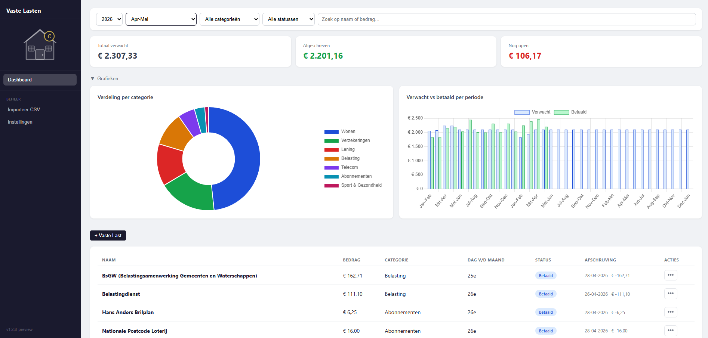

# Fixed Expenses

A personal finance web app to track recurring monthly costs, import bank statements, and manage your budget per salary period.

> **Language support:** The app interface is available in **English**, **Dutch (Nederlands)** and **German (Deutsch)**. Switch at any time using the EN | NL | DE buttons in the sidebar.

---

## Screenshot



> *No screenshot yet? Run the app and take one, then save it as `docs/screenshot.png`.*

---

## Getting Started

New to Fixed Expenses? The getting started guides walk you through setting up your expenses, exporting a CSV from your bank, and importing transactions.

| Language | Guide |
|---|---|
| English | [docs/getting-started-en.md](docs/getting-started-en.md) |
| Nederlands | [docs/getting-started-nl.md](docs/getting-started-nl.md) |
| Deutsch | [docs/getting-started-de.md](docs/getting-started-de.md) |

---

## Installation options

There are two ways to run this app:

| | Local | Cloudflare |
|---|---|---|
| **Setup** | Install Node.js and Git | Cloudflare account required |
| **Cost** | Free | Free (within Cloudflare's free tier) |
| **Access** | Your machine only | Accessible from anywhere |
| **Data** | Stored locally as a file | Stored in Cloudflare D1 |
| **Updates** | `git pull && npm start` | Automatic on push to `main` |

- **Local** — Runs on your own computer (Windows or Linux). No account needed. See [Running locally](#running-locally-without-cloudflare).
- **Cloudflare** — Hosted in the cloud, accessible from any device. See [Deployment](#deployment).

---

## Features

- **Dashboard** — Overview of recurring costs per period with status (paid, open, expected, inactive)
- **Deviation marking** — Rows are highlighted yellow when the debited amount deviates from the expected amount
- **Variable costs** — Mark costs as variable to skip deviation highlighting
- **Bank import** — CSV import from ING, ABN AMRO, Rabobank and Sparkasse with automatic format detection
- **Auto-matching** — Transactions are matched to recurring costs based on description pattern, IBAN, name, or amount + expected day
- **Boundary matching** — Transactions up to 20 days outside a period can still be matched to that period
- **Periods** — Budget periods based on your salary day; auto-generated on first launch and per year
- **Delete year** — Bulk-remove all periods and transactions for a given year from Settings
- **Year overview** — Aggregated view across all periods in a year
- **Year overrides** — Per-year customization of cost name, amount, category, and expected day
- **Categories** — Group recurring costs and view the distribution in charts
- **Charts** — Donut chart by category and bar chart comparing expected vs paid per period
- **Three languages** — Full interface in English, Dutch and German; preference saved in browser

---

## Tech Stack

| Layer | Technology |
|-------|------------|
| Frontend | Vanilla HTML/CSS/JS, Chart.js |
| Backend | Cloudflare Workers (Pages Functions) |
| Database | Cloudflare D1 (SQLite) |
| Hosting | Cloudflare Pages |
| CI/CD | GitHub Actions (lint → test → deploy) |
| Tests | Vitest |
| Linting | ESLint v9 |

---

## Project structure

```
├── functions/api/[[route]].js   # API handler (serverless)
├── lib/
│   ├── automatch.js             # Match logic (exported for tests)
│   └── csv.js                   # CSV parsing (exported for tests)
├── public/
│   ├── index.html               # Single-page app
│   ├── app.js                   # Frontend logic
│   ├── i18n.js                  # Translations (EN/NL/DE)
│   ├── style.css                # Styling
│   └── chart.min.js             # Chart.js library
├── docs/
│   ├── getting-started-en.md   # User guide (English)
│   ├── getting-started-nl.md   # User guide (Dutch)
│   └── getting-started-de.md   # User guide (German)
├── test/
│   ├── automatch.test.js        # Unit tests for match logic
│   └── csv.test.js              # Unit tests for CSV parsing
├── schema.sql                   # Database schema
├── wrangler.toml                # Cloudflare configuration
├── eslint.config.js             # ESLint configuration
├── CHANGELOG.md                 # Version history
└── .github/
    ├── workflows/deploy.yml     # CI/CD pipeline (lint → test → deploy)
    └── pull_request_template.md # PR template
```

---

## Running locally (without Cloudflare)

No Cloudflare account needed. The app runs entirely on your own machine with a local SQLite database. Choose your operating system below.

### Windows

#### Step 1 — Install Node.js

Go to [nodejs.org](https://nodejs.org/) and download the **LTS** version. Run the installer with the default settings.

Or via [winget](https://learn.microsoft.com/en-us/windows/package-manager/winget/):

```
winget install OpenJS.NodeJS.LTS
```

#### Step 2 — Install Git

Go to [git-scm.com/downloads](https://git-scm.com/downloads/win) and download Git for Windows. Run the installer with the default settings.

#### Step 3 — Verify the installation

Open **Command Prompt** or **PowerShell** and run:

```
node --version
git --version
```

Both commands should print a version number. If they do, continue.

#### Step 4 — Download the app

```
git clone https://github.com/jrhimself/vastelasten.git
cd vastelasten
npm install
```

#### Step 5 — Set a password (optional)

Create a file named `.env` in the project folder. Open Notepad, paste the lines below, and save as `.env` (make sure it is not saved as `.env.txt`):

```
AUTH_PASSWORD=choose-a-password
AUTH_SECRET=some-random-secret-string
```

> No password needed? Skip this step — the app will be accessible without login.

#### Step 6 — Start the app

```
npm start
```

Open your browser at **http://localhost:3000**.

---

### Linux (Ubuntu / Debian / Raspberry Pi)

#### Step 1 — Install Node.js

```bash
curl -fsSL https://deb.nodesource.com/setup_22.x | sudo -E bash -
sudo apt-get install -y nodejs
```

Or via [nvm](https://github.com/nvm-sh/nvm):

```bash
curl -o- https://raw.githubusercontent.com/nvm-sh/nvm/v0.40.3/install.sh | bash
source ~/.bashrc
nvm install 22
```

#### Step 2 — Install Git

Git is pre-installed on most Linux systems. If not:

```bash
sudo apt-get install -y git
```

#### Step 3 — Verify the installation

```bash
node --version
git --version
```

#### Step 4 — Download the app

```bash
git clone https://github.com/jrhimself/vastelasten.git
cd vastelasten
npm install
```

#### Step 5 — Set a password (optional)

```bash
cp .env.example .env
nano .env
```

Edit the values, then save with `Ctrl+O`, `Enter`, and exit with `Ctrl+X`.

#### Step 6 — Start the app

```bash
npm start
```

Open your browser at **http://localhost:3000**.

On a headless server (e.g. Raspberry Pi): open the app on another device via `http://<ip-address>:3000`. Find the IP address with `hostname -I`.

---

### Updating to a new version

```bash
git pull
npm install
npm start
```

Your data in `vastelasten.db` is preserved.

---

### FAQ

**Different port?** Add `PORT=4000` to your `.env` file.

**Stop the app?** Press `Ctrl + C` in the terminal.

**App won't start?** Make sure `node --version` shows version 22 or higher and that you have run `npm install`.

---

## Cloudflare hosting

Host the app in the cloud so it's accessible from any device. Requires a free [Cloudflare account](https://dash.cloudflare.com/sign-up) and the [Wrangler CLI](https://developers.cloudflare.com/workers/wrangler/install-and-update/).

### Setup

**1. Create a D1 database**

```bash
npx wrangler d1 create fixed-expenses-db
```

Copy the `database_id` from the output and update `wrangler.toml`.

**2. Apply the schema**

```bash
npx wrangler d1 execute fixed-expenses-db --remote --file=schema.sql
```

**3. Deploy**

```bash
npx wrangler pages deploy public
```

Or connect the repository to Cloudflare Pages via the dashboard for automatic deploys on every push to `main`.

### Local development (Wrangler)

```bash
npm install
npx wrangler pages dev public/ --d1 DB=fixed-expenses-db
```

On first run, apply the schema locally:

```bash
npx wrangler d1 execute fixed-expenses-db --local --file=schema.sql
```

---

## Tests

```bash
npm test
```

Runs unit tests with Vitest for match logic and CSV parsing.

---

## Deployment

The app is automatically deployed to Cloudflare Pages on every push. The GitHub Actions workflow:

1. **lint** and **test** — Run in parallel: ESLint check + unit tests
2. **deploy** — Deploys via `wrangler-action@v3` to Cloudflare Pages (only if lint and test pass)

Feature branches get a preview URL. Merging to `main` requires a PR and a passing `test` check.

**Required GitHub Secrets:**
- `CLOUDFLARE_API_TOKEN`
- `CLOUDFLARE_ACCOUNT_ID`

---

## Versioning

Semantic versioning (semver). Feature branches are created as `feature/vX.Y.Z`. All changes are tracked in [`CHANGELOG.md`](CHANGELOG.md).

- **PATCH** (1.0.x) — Bug fixes
- **MINOR** (1.x.0) — New features
- **MAJOR** (x.0.0) — Breaking changes

The current version is displayed at the bottom of the sidebar in the app.

---

## API Endpoints

| Method | Path | Description |
|--------|------|-------------|
| `GET` | `/api/lasten` | Get all recurring costs |
| `POST` | `/api/lasten` | Create a recurring cost |
| `PUT` | `/api/lasten/:id` | Update a recurring cost |
| `DELETE` | `/api/lasten/:id` | Permanently delete a recurring cost |
| `GET` | `/api/periodes` | Get all periods |
| `POST` | `/api/periodes` | Create a new period |
| `POST` | `/api/periodes/genereer/:jaar` | Generate periods for a year |
| `DELETE` | `/api/periodes/jaar/:jaar` | Delete all periods for a year |
| `GET` | `/api/periodes/jaar/:jaar/overzicht` | Year overview with all periods |
| `GET` | `/api/periodes/:id/overzicht` | Period overview with linked transactions |
| `DELETE` | `/api/periodes/:id` | Delete a single period |
| `POST` | `/api/periodes/:id/hermatchen` | Re-match all transactions in a period |
| `POST` | `/api/periodes/:id/hermatchen/:last_id` | Re-match a specific cost in a period |
| `POST` | `/api/periodes/:id/koppel/:last_id` | Manually link a transaction to a cost |
| `GET` | `/api/periodes/:id/alle-ongekoppeld` | Get unlinked transactions (incl. boundary) |
| `POST` | `/api/periodes/verwijder-duplicaten` | Remove duplicate periods |
| `POST` | `/api/import/preview` | Preview a CSV file |
| `POST` | `/api/import/opslaan` | Save imported transactions |
| `GET` | `/api/statistieken` | Get chart data |
| `GET` | `/api/transacties` | Search transactions |
| `GET/PUT` | `/api/instellingen` | Manage settings |
| `GET/POST/PUT/DELETE` | `/api/jaar-overrides` | Manage per-year cost overrides |

---

## Database

Seven tables in Cloudflare D1 (SQLite):

- **vaste_lasten** — Recurring costs with name, amount, category, IBAN, description pattern, and variable flag
- **periodes** — Budget periods with start/end date
- **bank_transacties** — Imported bank transactions linked to a cost and period
- **periode_overgeslagen** — Skipped costs per period
- **vaste_last_periode_actief** — Per-period activation of costs
- **vaste_last_jaar_overrides** — Per-year customization of cost properties
- **instellingen** — Key-value settings (e.g. salary day)

---

## License

Private project.
